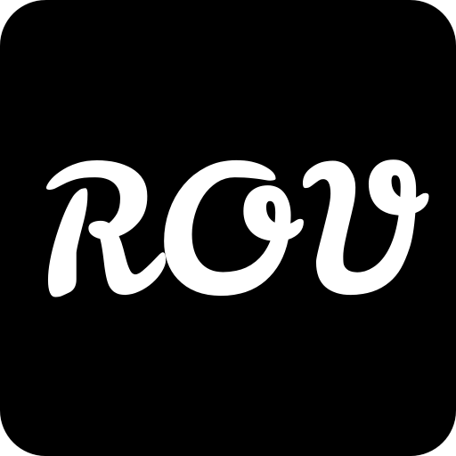

# robot-CuttleOS

[]
[]
[](https://www.raspberrypi.com/)
[](https://www.python.org/)
[](https://fastapi.tiangolo.com/)
[](https://vuejs.org/)
[](https://nats.io/)

<p align="center">
  
</p>

CuttleOS is the robot-side software stack for Raspberry Pi-based robots. It
provides the shared Cockpit, Control and Datalogger services for the ROV, K9
and future robot profiles.

CuttleOS is one part of a related set of projects:

- [SquidLink](https://github.com/PhilipMcGaw/robot-SquidLink) — the independent
  ROV software-in-the-loop and hardware-in-the-loop environment using ROS 2,
  Gazebo and the same application-facing NATS contracts.
- [NautiPi](https://github.com/PhilipMcGaw/robot-NautiPi) — the physical hardware,
  electronics and Arduino project work supporting the robots.

The relationship is deliberately straightforward: CuttleOS runs the real
robot software, SquidLink provides simulation and integration testing, and
NautiPi contains the physical hardware and embedded-project material. They are
separate projects with defined interfaces rather than one shared codebase.

## Demo

I have a demo of my Robot Cockpit 🙂 https://cuttleos.philipmcgaw.com/

## People who have helped

- Philip 'Skippy' McGaw - <philip@mcgaw.eu> - [philipmcgaw.com](https://philipmcgaw.com)
- Tamarisk 'NotQuiteHere' McGaw - <tamarisk@mcgaw.eu> - [tamarisk.it](https://tamarisk.it)
- Bob 'thinkl33t' Clough - <bob@clough.me> - [thinkl33t.co.uk](https://thinkl33t.co.uk)

## Architecture

This project uses a monorepo structure with the following layout:

```
robot-CuttleOS/
├── cockpit/           # FastAPI web service and static browser assets
├── control/           # Hardware-facing control service
├── datalogger/        # NATS telemetry logger
├── frontend/          # Frontend source and build configuration
│   └── cockpit/
├── assets/            # Version-controlled shared and robot assets
├── configs/           # Configuration files
│   ├── robots/        # Robot-specific configs (rov.yaml, k9.yaml)
│   └── profiles/      # Cockpit profiles
├── tests/             # Test suites
├── scripts/           # Build and deployment scripts
├── docs/              # Documentation
├── data/              # Runtime data (CSV logs, etc.)
└── media/             # Media files (stills, videos)
```

## Components

### Cockpit (cockpit/)
FastAPI-based web application providing:
- Browser-based operator interface
- WebSocket telemetry streaming
- Low-latency live video and media presentation
- Mono and planned stereo camera support
- Local video and still recording/download management
- Optional live and recorded audio
- Authentication and role-based access
- Configuration UI
- Gamepad/operator input support
- Capability-driven UI adaptation for different robot profiles

### Media architecture

CuttleOS treats camera acquisition, recording, live transport, and presentation
as separate concerns. Stereo video is a common capability for robots such as K9
and ROV rather than a K9-specific implementation.

```text
Camera / microphone
        │
        ├──► Local recorder ──► Vehicle storage
        │          │
        │          └──► video + audio master
        │
        └──► Live media service ──► WebRTC ──► Operator / Quest

NATS telemetry + control logs ──► Datalogger
             │
             └──► timestamp-aligned export / subtitles
```

Local recording is independent of the operator connection. Live video is
on-demand, so a robot with zero viewers does not need to send live video over
its network link. WebRTC is the preferred live transport where low latency is
important, particularly for K9 operation over a mobile network. Live quality
must be adaptive and must not starve safety-critical control or telemetry.

The master recording preserves native stereo where available. Telemetry and
control remain authoritative in their raw NATS/logging forms; presentation
formats such as WebVTT subtitles or rendered overlays are derived outputs.
Video, audio, telemetry, and control events should share a common time
reference.

K9's planned media capability includes a USB microphone for live environmental
awareness, microphone audio in saved recordings, and a low-latency audio return
path to the robot speaker/soundboard. K9 also has planned dedicated high-capacity
local storage, while ROV storage remains an optional discovered capability.

### Frontend
TypeScript frontend source is under `frontend/src/`, with the npm package and
toolchain under `frontend/cockpit/`. The compiled browser modules are emitted
to `cockpit/src/rov_cockpit/static/dist/`.

### Configuration
- Robot definitions in `configs/robots/`
- Cockpit profiles in `configs/profiles/`
- Service configurations in `configs/`

## Getting Started

### Quick Start (One-Click Setup)

For complete robot deployment on a Raspberry Pi, follow [the deployment guide](docs/deployment.md).
The bootstrap script requires root privileges:

```bash
curl -fsSL https://raw.githubusercontent.com/PhilipMcGaw/robot-CuttleOS/main/scripts/bootstrap_robot.sh | sudo bash
```

Set options in the environment before invoking the script, for example:

```bash
sudo ROBOT_PROFILE=k9 ROBOTS_DIR=/home/philip/robots bash scripts/bootstrap_robot.sh
```

See `ONE-LINE-SETUP.txt` for complete one-liner reference and `QUICKSTART.txt` for detailed setup instructions.

### Manual Setup

For local development or manual deployment:

```bash
# Install dependencies
./scripts/1_install_dependencies.sh

# Build frontend
./scripts/build_frontend.sh

# Start the application
./scripts/2_start_app.sh
```

### Raspberry Pi Deployment

For manual Raspberry Pi provisioning:

```bash
# Run the provisioning script (requires sudo)
sudo ./scripts/0_provision_rpi.sh
```

This installs all system packages, Python environments, services, and configuration.

### Robot Profile Switching

Switch between different robot configurations (ROV, K9, PiWars):

```bash
# Switch to ROV profile
sudo ./scripts/switch_robot_profile.sh rov

# Switch to K9 profile
sudo ./scripts/switch_robot_profile.sh k9

# Switch to PiWars profile
sudo ./scripts/switch_robot_profile.sh piwars
```

Switching to K9 automatically checks and installs `espeak-ng` and `sox`; shared `alsa-utils` support is installed for all robot profiles.

Available profiles: `rov`, `k9`, `piwars`

### Robot Types
- **ROV**: Underwater robot with depth, heading, drive, camera, lights, and planned stereo/media capabilities
- **K9**: Ground robot with drive, camera, head, lights, and planned stereo/audio/media capabilities

## Technology Stack
- **Backend**: Python, FastAPI, NATS
- **Frontend**: TypeScript, Vue.js
- **Configuration**: YAML/TOML
- **Validation**: Pydantic
- **Live media**: WebRTC planned for low-latency video/audio

## Documentation
See `docs/` for detailed documentation on development, deployment, and testing.
See `MASTER_CONTEXT.md` for architectural decisions and service boundaries.
See `ROADMAP.md` for planned architectural improvements and feature development.
See `docs/status.md` for implementation and validation status.
See `docs/robot-profile-requirements.md` for profile and capability contracts.

## License
See `LICENSES.md` for license information.
